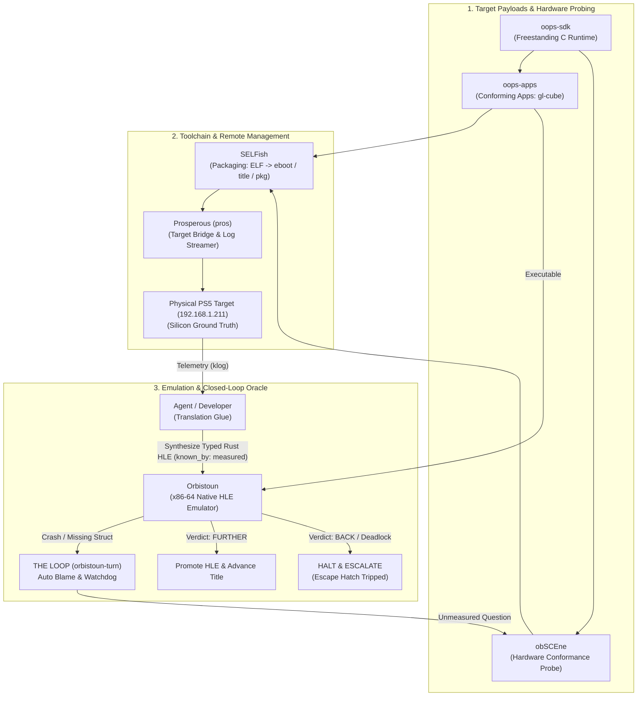

<!-- oops:profile -->
<p align="center">
  
</p>

# OOPS

**The Clean-Room Toolchain, Hardware Oracle, and Emulation Platform.**

OOPS (**O**rbistoun, **o**bSCEne, **P**rosperous, **S**ELFish) is an open-source, mathematically grounded platform stack for 8th and 9th generation console software (Orbis and Prospero). It combines an x86-64 native emulator, a live silicon hardware probe, a remote target management tool, and platform file format compilers.

Site: **[project-oops.github.io/OOPS](https://project-oops.github.io/OOPS/)**

| 📖 **[User Guide & Getting Started](docs/USER_GUIDE.md)** | ⚙️ **[Technical Architecture Reference (THE LOOP)](docs/THE_LOOP.md)** |
| :--- | :--- |
| *End-user workflows, building tools, deploying to PS5, and testing.* | *Closed-loop oracle, clean-room provenance, and deep architecture.* |

---

## The Core Concept: THE LOOP

Unlike traditional homebrew or emulation efforts that develop in fragmented silos—often relying on leaked vendor SDKs, unverified guesses, or fragile per-game emulator hacks—**OOPS is designed as an interconnected, closed-loop feedback engine.**

Every project in OOPS feeds into and verifies its siblings:



👉 **Read the comprehensive specification in [docs/THE_LOOP.md](docs/THE_LOOP.md)**.

---

## The Seven Repositories at a Glance

The collection consists of **four primary pillars** and **three supporting repositories**:

| Repository | Focus | Role in THE LOOP | Primary Commands |
|---|---|---|---|
| **[Orbistoun](orbistoun/)** | The Emulator | Executes guest x86-64 code natively; auto-blames crashes via watchpoints and consumes silicon measurements. | `./bin/orbistoun run <title>`<br/>`orbistoun-cli questions` |
| **[obSCEne](obscene/)** | The Hardware Oracle | Runs 400+ targeted checks directly on PS5 hardware to measure empirical struct layouts and return codes. | `./bin/obscene build`<br/>`scripts/sweep.sh` |
| **[Prosperous](prosperous/)** | Target Management | Remotely registers consoles, deploys title packages over LAN, launches execution, and streams `klog`. | `pros check`<br/>`pros restore <dir> <dst>`<br/>`pros launch <id>` |
| **[SELFish](selfish/)** | File Formats | Clean-room compiler and reader for signed executables (`eboot.bin`), title metadata (`param.json`, `keystone`), and `.pkg` files. | `selfish --format title`<br/>`selfish elf <file>` |
| **[oops-sdk](oops-sdk/)** | Freestanding C SDK | Clean-room libc, RDNA2 AGC display/tiler, DualSense input, and audio runtime used by target payloads. | `include $(OOPS_SDK)/oops-sdk.mk` |
| **[oops-apps](oops-apps/)** | Test Apps & Tracer | Known-source 3D test titles ([`gl-cube`](oops-apps/src/gl-cube)) and passive telemetry [`tracer`](oops-apps/src/tracer/) for capturing commercial game calls & shaders. | `make title`<br/>`./bin/oops-apps check` |
| **[oops-libs](oops-libs/)** | Shared Rust Libs | Shared infrastructure for host tools: unified logging (`oops-log`), build stamps (`oops-build`), and paths (`oops-paths`). | Path dependency in host tools |

---

## Quickstart Guide

### 1. Prerequisites
- **Rust toolchain** (stable 2021 edition)
- **C Cross-Compiler** (`clang` and `lld` 18+ for target payloads; Windows users use WSL or container)

### 2. Clone the Collection
```bash
git clone --recurse-submodules https://github.com/project-oops/OOPS
cd OOPS
```

### 3. Environment Doctor & Build
On Windows, `bin/oops setup` installs the lightweight `oops-builder` WSL distribution for compiling C payloads:
```bash
./bin/oops setup           # Windows: sets up WSL oops-builder distribution
./bin/oops doctor          # verify toolchains and dependencies
./bin/oops build           # compile all tools and libraries
./bin/oops test            # run the shared test suites
```

### 4. Common Developer Workflows

#### A. Build a 3D Test Application
```bash
cd oops-apps/src/gl-cube
make title
```
This compiles `gl-cube.elf` using `oops-sdk` and automatically packages a complete title directory (`build/title/GLCB00001/`) using `selfish` and `obscene-tool`.

#### B. Deploy and Run on Real Hardware
```bash
# Check console status (target IP defaults to config or 192.168.1.211)
pros.exe check

# Deploy title to /data/homebrew/ scan root and launch
pros.exe restore oops-apps\src\gl-cube\build\title\GLCB00001 /data/homebrew/GLCB00001
pros.exe launch GLCB00001

# Stream live console kernel log
pros.exe logs --seconds 15
```

#### C. Run in the Orbistoun Emulator
```bash
cd orbistoun
./bin/orbistoun run GLCB00001
```
Orbistoun parses the title container, resolves imports by NID hash, executes natively, and diffs the resulting trace against previous runs (`FURTHER` / `same` / `BACK`).

---

## Strict Clean-Room Rules (CONVENTIONS §1 & §10)

1. **Zero Leaked Code**: Zero vendor SDK headers, zero leaked binaries, zero disassembled source code reproduction. Every subsystem is freestanding and documented from public specifications or empirical hardware measurements.
2. **First-Party Tooling Only**: Never bypass collection tools with one-off Python or shell scripts. We always use `selfish` for packaging, `pros` for hardware transport, and `app.mk` for builds. If a tool has a bug or lacks a flag, **we fix the tool**.
3. **No Fake Stubs (The Anti-Kyty Principle)**: Emulators must never forge return codes to bypass crashes. Gaps are measured on real silicon via `obSCEne`, grounded in `known_by: measured`, or left as explicit failing stubs.

---

## Directory Layout & Shared Paths

```
OOPS/                ← Meta-repository and shared orchestration scripts
  orbistoun/         ← Submodule: High-level emulator
  obscene/           ← Submodule: Hardware conformance probe
  prosperous/        ← Submodule: Target management CLI (pros) and GUI
  selfish/           ← Submodule: File format compiler and inspector
  oops-sdk/          ← Submodule: Clean-room freestanding C SDK
  oops-apps/         ← Submodule: Conforming homebrew titles & testbed
  oops-libs/         ← Submodule: Shared host-side Rust crates
  docs/              ← Ecosystem conventions, architecture, THE LOOP
  bin/oops           ← Master CLI dispatcher for the entire collection
```

Every tool shares a unified data directory:
- **Windows**: `%APPDATA%\OOPS\` (configs, target registries, save data) and `%LOCALAPPDATA%\OOPS\` (rebuildable caches, logs)
- **Linux / macOS**: `~/.local/share/OOPS/` and `~/.cache/OOPS/`

---

## Where to Read Next

- **[docs/THE_LOOP.md](docs/THE_LOOP.md)** — The complete specification of the automated development and hardware oracle loop.
- **[docs/CONVENTIONS.md](docs/CONVENTIONS.md)** — Core engineering rules: provenance, clean-room standards, and decision logging.
- **[docs/BUILDING.md](docs/BUILDING.md)** — Complete reference for `./bin/oops` commands, cross-compilation, and CI workflows.
- **[docs/ARCHITECTURE.md](docs/ARCHITECTURE.md)** — Detailed inter-project boundaries and compile-time/runtime dependencies.
- **[docs/GLOSSARY.md](docs/GLOSSARY.md)** — Platform terminology, NID hashes, and ELF structures demystified.

---

## License

Dual-licensed under [MIT](LICENSE-MIT) or [Apache-2.0](LICENSE-APACHE), at your option.
<!-- /oops:profile -->
