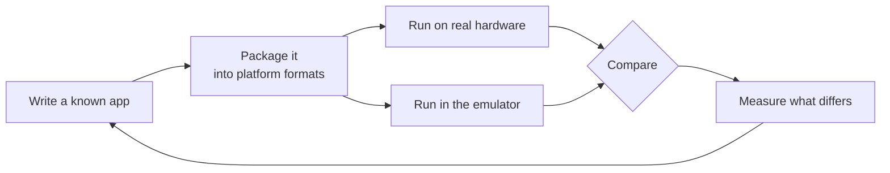

<!-- oops:profile -->
<p align="center">
  
</p>

# OOPS

**Run console software on an ordinary PC — from a codebase that can be shared.**

OOPS (**O**rbistoun, **o**bSCEne, **P**rosperous, **S**ELFish) is an open toolchain and
emulation platform for the Orbis and Prospero consoles. It builds native homebrew, packages it
into the platform's own file formats, runs it on real hardware or in an emulator, and uses the
difference between the two to work out how the platform behaves.

Site: **[project-oops.github.io/OOPS](https://project-oops.github.io/OOPS/)**

| 📖 **[User Guide & Getting Started](docs/USER_GUIDE.md)** | ⚙️ **[How it fits together (THE LOOP)](docs/THE_LOOP.md)** |
| :--- | :--- |
| *Install the tools, build a title, and run it on hardware or in the emulator.* | *The closed feedback loop the projects form, end to end.* |

## The loop

Every project checks its siblings. An application whose source we wrote runs two ways — on real
silicon and in the emulator — and where the two disagree is exactly where there is something to
learn.



## The collection

Clone this repository and you have everything, arranged so it builds — the projects depend on
one another. Each also stands alone in its own repository, where its releases, issues and a
README aimed at whoever *uses* that one thing live.

| Repository | What it is |
|---|---|
| **[Orbistoun](https://github.com/project-oops/Orbistoun)** | The emulator. Runs guest code natively and reconstructs the operating system beneath it. |
| **[obSCEne](https://github.com/project-oops/obSCEne)** | The hardware probe. A program we wrote that asks the real platform questions and reports what it measured. |
| **[Prosperous](https://github.com/project-oops/Prosperous)** | Remote management. Registers a target, deploys to it, launches, and streams its logs. |
| **[SELFish](https://github.com/project-oops/SELFish)** | The file formats. One shared reader and writer for the platform's executables, titles and packages. |
| **[oops-sdk](https://github.com/project-oops/oops-sdk)** | The freestanding C runtime the target software is built on. |
| **[oops-apps](https://github.com/project-oops/oops-apps)** | Known-source homebrew and graphics demos — the testbed the rest is measured against. |
| **[oops-mesa](https://github.com/project-oops/oops-mesa)** | Desktop-class OpenGL on the target, carried over from upstream Mesa. |
| **[oops-libs](https://github.com/project-oops/oops-libs)** | Shared building blocks for the host-side tools. |

These are the submodule directories under `OOPS/`.

## Why it is built this way

It is not hard to make an emulator work by copying what the hardware does. It is hard to make
one whose every behaviour can be explained from a lawful source — and only that kind can be
shared, packaged, or accepted from a contributor. So everything here is written from public
documentation or measured on hardware, and where a fact came from is recorded beside it. That
one constraint is why there are separate projects rather than a single program.
<!-- /oops:profile -->

---

## Build it

One command drives the whole collection:

```bash
git clone --recurse-submodules https://github.com/project-oops/OOPS
cd OOPS
./bin/oops setup      # first run: prepares the build environment
./bin/oops build      # build the tools and libraries
```

The full reference — cross-compilation, the per-project commands, and CI — is in
**[docs/BUILDING.md](docs/BUILDING.md)**.

## Read next

- **[docs/THE_LOOP.md](docs/THE_LOOP.md)** — how the projects form one feedback loop.
- **[docs/USER_GUIDE.md](docs/USER_GUIDE.md)** — end-to-end workflows.
- **[docs/ARCHITECTURE.md](docs/ARCHITECTURE.md)** — how the projects fit together.
- **[docs/CONVENTIONS.md](docs/CONVENTIONS.md)** — the engineering rules, including the clean-source provenance standard.
- **[docs/GLOSSARY.md](docs/GLOSSARY.md)** — platform terminology.

## License

Dual-licensed under [MIT](LICENSE-MIT) or [Apache-2.0](LICENSE-APACHE), at your option.
