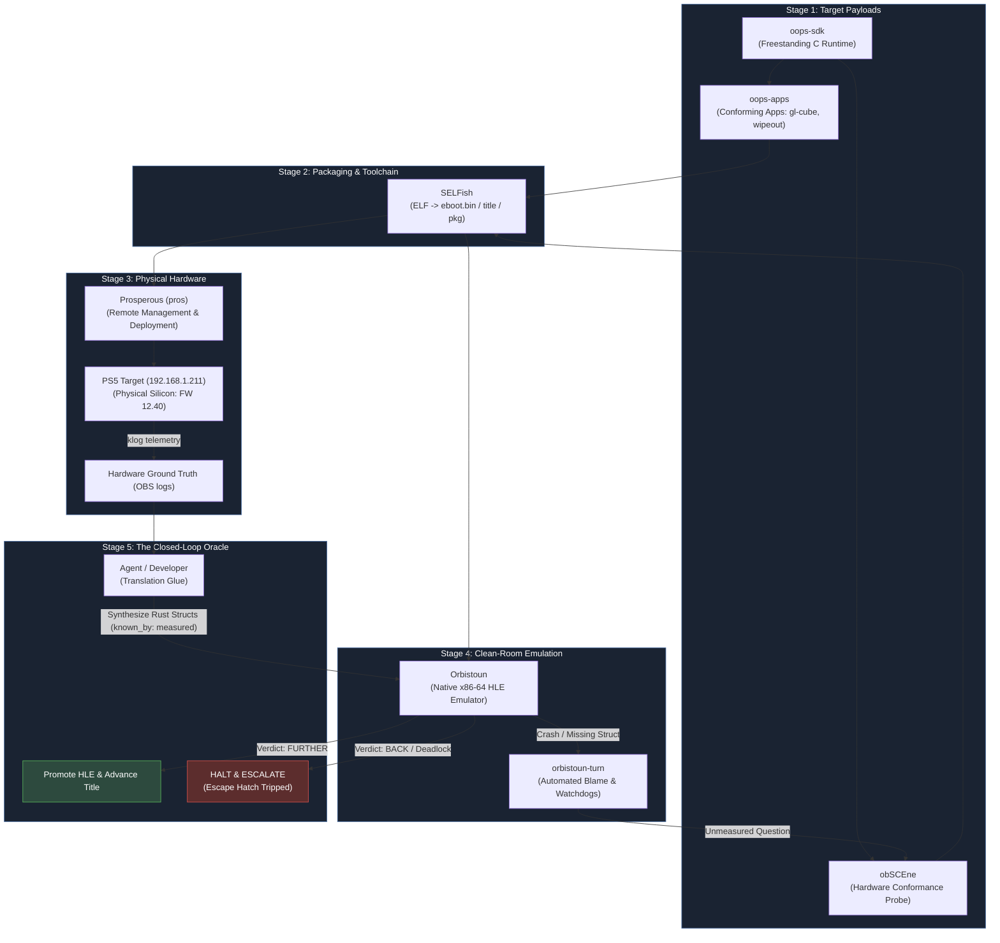

# The OOPS Loop

**How the seven repositories of the OOPS collection form a single, self-developing engineering cycle.**

---

## 1. What is The Loop?

Traditional console emulation and homebrew development are notoriously fractured:
- Homebrew developers rely on leaked vendor SDKs or reverse-engineered headers of uncertain provenance.
- Emulator authors debug commercial games in a vacuum, writing per-game hacks and plausible-sounding stubs to bypass crashes, only to create delayed, untraceable memory corruption thousands of frames later (the *Kyty trap*).

**OOPS replaces that fragmentation with a closed-loop feedback engine.**

Instead of operating in isolation, every repository in the OOPS collection feeds into and verifies its siblings. We build conforming applications with our own clean-room SDK, package them with our own container tools, deploy and run them on physical PS5 hardware, measure real silicon behavior, and use those empirical measurements to ground our emulator.



---

## 2. The Five Stages of The Loop

### Stage 1: Build the Payload (`oops-sdk` & `oops-apps`)
- **[oops-sdk](../oops-sdk/)**: A 100% clean-room, freestanding C runtime (`-ffreestanding -nostdlib`). Implements direct AGC GPU buffer allocations, hardware tile swizzling, DualSense input polling, audio PCM streaming, and POSIX threading stubs without touching vendor SDK headers.
- **[oops-apps](../oops-apps/)**: Known-source applications built on `oops-sdk` (e.g. [`gl-cube`](../oops-apps/src/gl-cube), [`wipeout`](../oops-apps/src/wipeout), [`home`](../oops-apps/src/home)). Because we write the source code, any rendering artifact or crash has an unambiguous ground-truth expectation.

### Stage 2: Package with Conforming Formats (`SELFish`)
- **[SELFish](../selfish/)**: Wraps compiled `.elf` binaries into signed-executable containers (`eboot.bin`), structures title directories (`--format title`), synthesizes conforming metadata (`param.json`, fake-signed `keystone`, `nptitle.dat`), and packages installable files (`.pkg`).
- Eliminates one-off Python/bash packager scripts. Every file matches official container specifications.

### Stage 3: Remote Hardware Deployment (`Prosperous`)
- **[Prosperous](../prosperous/) (`pros`)**: Discovers and connects to jailbroken PS5 consoles over LAN.
- Stages title directories (`pros restore <title> /data/homebrew/<ID>`), launches titles (`pros launch <ID>`), and streams real-time console kernel logs (`pros logs`).

### Stage 4: Silicon Ground Truth & Probing (`obSCEne` & `tracer`)
- **[obSCEne](../obscene/) (Active Probing)**: The hardware conformance probe. Executes 400+ targeted checks one-by-one directly on PS5 silicon to measure exact system call return codes, struct sizes, alignment boundaries, and RDNA2 GPU packet encodings.
- **[tracer](../oops-apps/src/tracer/) (Passive Observation)**: While obSCEne actively probes controlled inputs, `tracer` hooks running commercial games in-process on real hardware. It records actual call sequences, valid constant spaces, out-parameter buffer diffs, submitted PM4 DCB command buffers, and bound RDNA2 shader binaries without modifying game code. Decoded traces feed directly into `orbistoun-corpus` and `orbistoun-gpu`.

#### Why Three obSCEne Target Builds? (`payload`, `eboot`, `pkg`)
On real console firmware, **privileges, sandboxing, and library resolution change depending on how code is launched**. Testing all three execution contexts (`./scripts/sweep.sh`) is essential to map the operating system:

| Context | Delivery & Loader | Privileges & Environment | What It Measures |
|---|---|---|---|
| **`payload`** | Sent to `:9021` via `elfldr` (`pros send`). Bare ELF. | Outside title sandbox; elevated kernel privileges; raw POSIX socket and memory access. | Raw kernel syscalls, hardware device drivers, and memory paging without userland restrictions. |
| **`eboot`** | Staged in `/data/homebrew/<ID>` and launched via `pros launch`. | Signed container running as a retail `BIG_APP` (`category 0`); HDMI display ownership; controller focus. | Universal graphics queues (`libSceAgc`), video scanout, DualSense controller polling, and retail app lifecycle. |
| **`pkg`** | Installed application under PFS encrypted filesystem. | Strict retail sandbox permissions (`0600`); restricted filesystem; full OS security barriers. | Save data mounting (`libSceSaveData`), background downloads (`BGFT`), entitlement checks, and retail sandboxing. |

*A function that succeeds in `payload` might fail in `pkg` due to sandbox restrictions, and vice-versa. The 3-leg sweep isolates whether a behavior is an OS capability or a sandbox boundary.*

### Stage 5: Emulation, Automated Blame & Oracle (`Orbistoun`)
- **[Orbistoun](../orbistoun/)**: High-level PS5 emulator in Rust. Executes guest x86-64 code natively and translates RDNA2 PM4 command streams to Vulkan.
- When a title halts or crashes, [`orbistoun-turn`](../orbistoun/crates/orbistoun-turn) takes over:
  1. **Automated Blame**: Identifies which register or unwritten struct field triggered the crash.
  2. **Question Formulation**: Checks whether the behavior is known. If unmeasured, it files a formal hardware probe request.
  3. **Hardware Dispatch**: Dispatches the probe to `obSCEne` on the PS5 via `pros`.
  4. **Conforming Implementation**: Telemetry from `klog` is translated into typed Rust HLE structs tagged `known_by: measured`.
  5. **Gated Verification**: The title is re-run. If the trace verdict is `FURTHER`, the patch is kept. If it regresses (`BACK`), it is reverted.
- **The Agentic Stack**: Autonomous closed-loop translation is driven by our tiered LLM developer stack: **Gemini 3.8 Flash** as the primary workhorse, **Claude Opus 5** for compiler/architectural reasoning, and **Fable 5.1** for verification sweeps. Operational guidelines and classifier mitigation rules are documented in [AGENTS.md](../AGENTS.md#5-coding-agent-tiering--llm-developer-toolchain).

---

## 3. The Escape Hatch Protocol

The loop is designed to automate routine HLE system calls and API expansions without human drag. However, to prevent falling into the **Kyty trap** (generating lying stubs or looping infinitely), strict **Escape Hatch** triggers immediately stop execution, roll back uncommitted trial patches, and alert the developer:

| Trigger | Condition | System Action |
|---|---|---|
| **1. Architectural Wall** | Crash caused by missing GPU PM4 opcode, unsupported RDNA2 shader instruction, or host/guest ABI misalignment. | Halt immediately. Compiler and architectural passes cannot be fuzzed. |
| **2. Spin Deadlock** | Guest loops indefinitely on synchronization primitives (`sceKernelWaitElink`, `sched_yield`) without advancing module init. | Watchdog timer trips; aborts run and flags spinlock deadlock. |
| **3. Regression Wall** | A change unblocks function $A$ but causes an earlier, previously stable function $B$ to fault (`verdict: BACK`). | Revert trial patch instantly. |
| **4. Retry Exhaustion** | 3 consecutive probe-and-implement attempts on the same finding fail to achieve `FURTHER`. | Log finding in `worklog.md` under `[ESCALATION-NEEDED]`. |

---

## 4. Cross-Project Sibling Dependencies

The OOPS collection is checked out as side-by-side sibling repositories under a single meta-root. Tools resolve their dependencies via clean relative paths:

| Consumer | Sibling Dependency | Purpose |
|---|---|---|
| `obscene` | `../../selfish/crates/*` | Package authoring and container parsing |
| `obscene` | `../../prosperous/crates/pros-link` | Remote target deployment & test transport |
| `obscene` | `../../oops-sdk` | Freestanding C runtime for probe payloads |
| `oops-apps` | `../../oops-sdk` | Shared application Makefile (`app.mk`) and libc stubs |
| `oops-apps` | `../../selfish` | Automated title packaging (`make title`) |
| `orbistoun` | `../../oops-libs/crates/*` | Shared build metadata, paths, and logging |
| `prosperous` | `../../selfish/crates/selfish-title` | Title metadata and SFO parsing |

---

## 5. How to Run The Loop (Quick Reference)

### 1. Check Target Hardware Reachability
```bash
pros.exe check
```

### 2. Build and Package a Test Title
```bash
cd <OOPS>\oops-apps\src\gl-cube
make title
```

### 3. Deploy and Launch on PS5
```bash
pros.exe restore build\title\GLCB00001 /data/homebrew/GLCB00001
pros.exe launch GLCB00001
pros.exe logs --seconds 10
```

### 4. Run the Same Title in Orbistoun Emulator
```bash
cd <OOPS>\orbistoun
./bin/orbistoun run GLCB00001
```

### 5. Inspect Open Questions & Blame
```bash
orbistoun-cli questions
orbistoun-cli worklist
```
