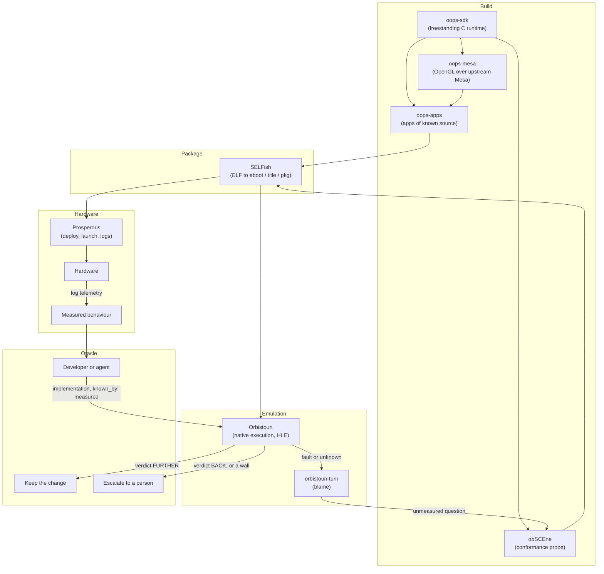

# The OOPS loop

How the repositories of the collection feed and check each other. Applications of known source
are built with the collection's own SDK, packaged with its own format tools, run on the hardware
and in the emulator, and the hardware's measured behaviour is what the emulator implements.

## Stages

### Build: oops-sdk and oops-apps

- [oops-sdk](../oops-sdk/) is a freestanding C runtime (`-ffreestanding -nostdlib`): GPU
  memory and tiling, controller input, audio, and POSIX threading, written without vendor
  headers.
- [oops-apps](../oops-apps/) holds applications built on it, such as
  [`gl1-cube`](../oops-apps/src/oops-gl/gl1-cube), [`mesa-cube`](../oops-apps/src/oops-mesa/mesa-cube)
  and [`seashell`](../oops-apps/src/oops-utilities/seashell). Their source is ours, so every
  rendering result and every fault has a known expected outcome.

### Package: SELFish

[SELFish](../selfish/) turns an ELF into a signed-executable container (`eboot.bin`), lays out
a title directory with its metadata (`--format title`), and builds installable packages
(`--format pkg`).

### Deploy: Prosperous

[Prosperous](../prosperous/) (`pros`) registers a target on the network, stages a title
(`pros restore <dir> /data/homebrew/<id>`), launches it (`pros launch <id>`) and streams the
kernel log (`pros logs`).

### Measure: obSCEne and the tracer

- [obSCEne](../obscene/) probes the hardware actively: each check asks one question (a system
  call's return code, a structure's size, a GPU packet's encoding) and reports what it measured.
- The [tracer](../oops-apps/src/oops-payloads/tracer/) observes passively: it records a running
  title's calls, out-parameters, GPU command buffers and shaders without changing its code.
  Decoded traces feed `orbistoun-corpus` and `orbistoun-gpu`.

obSCEne builds in three forms, because what a process may do depends on how it was launched
(`obscene#D121`); `obscene/scripts/sweep.sh` runs all three.

| Form | Delivery | Environment | Measures |
|---|---|---|---|
| `payload` | a bare ELF sent to the payload loader (`pros send`) | outside the title sandbox | kernel calls, device drivers, memory mapping |
| `eboot` | a title directory under `/data/homebrew/<id>`, launched with `pros launch` | a `BIG_APP` title with display and controller focus | graphics queues, scanout, controller input, the title lifecycle |
| `pkg` | an installed package | the full title sandbox | save data, background downloads, entitlement checks |

A call that succeeds in one form and fails in another separates an operating-system capability
from a sandbox boundary.

### Emulate: Orbistoun

[Orbistoun](../orbistoun/) runs guest x86-64 code natively and translates GPU command streams
to Vulkan. When a title faults or stops, [`orbistoun-turn`](../orbistoun/crates/orbistoun-turn):

1. identifies the register or unwritten field behind the fault;
2. checks whether the behaviour is known, and files a probe request when it is not;
3. has the probe run on hardware through obSCEne and `pros`;
4. has the measurement implemented, tagged `known_by: measured`;
5. reruns the title: a `FURTHER` verdict keeps the change, `BACK` discards it.

The models that drive the loop are listed in [AGENTS.md](../AGENTS.md#4-models).

## The escape hatch

The loop stops and escalates to a person, discarding its trial changes, when a trigger trips
(`orbistoun/crates/orbistoun-turn/src/escape.rs`):

| Trigger | Condition |
|---|---|
| Architectural wall | an unrecognised GPU packet opcode, an untranslatable shader instruction, or an ABI boundary violation |
| Spin deadlock | the guest is stuck in its own synchronisation and calls the host nothing |
| Regression | a change makes the guest reach less than the baseline (verdict `BACK`) |
| Retry exhaustion | three attempts on one finding, none of them `FURTHER` |
